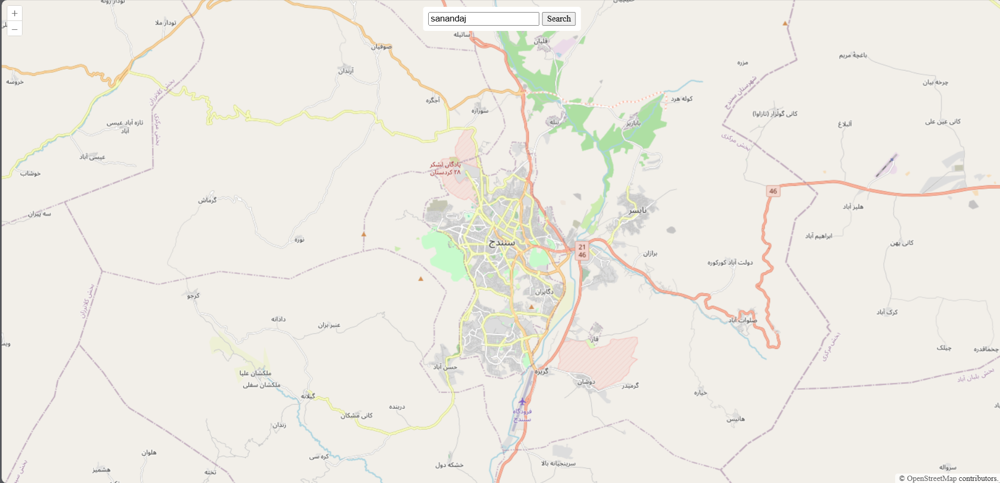
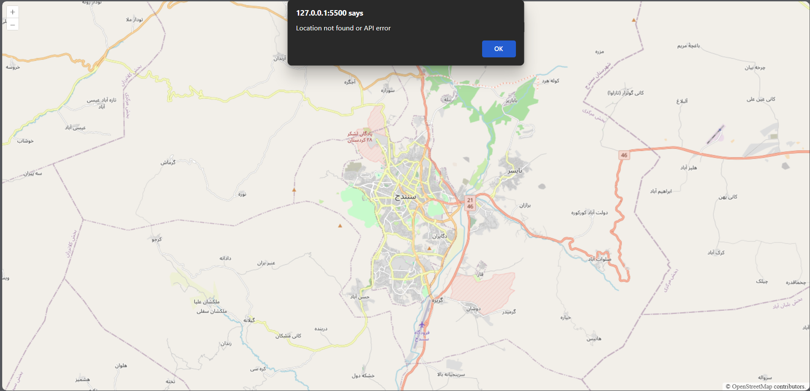

# Interactive Map with Geocoding Search - Part 1

## Project Overview
This project demonstrates an interactive map using the **OpenLayers** library with a geocoding search feature. Users can search for a location by name, and the map will smoothly animate to the found location. The geocoding functionality is implemented using the **LocationIQ API**.

- **Initial API Considered:** We first looked at **MapQuest Geocoding API**, but it required identity verification and account setup for financial purposes, so we decided not to use it.  
- **Final Choice:** **LocationIQ** was chosen as a free and easy-to-use alternative.
---

## OpenLayers Features Used

- **Map Initialization (`ol.Map`)**  
  Sets up the map container and base layer.

- **Base Layer (`ol.layer.Tile` with `ol.source.OSM`)**  
  Uses OpenStreetMap tiles as the base layer.

- **View (`ol.View`)**  
  Defines the initial center and zoom level of the map.

- **Animations (`map.getView().animate()`)**  
  Smoothly pans and zooms the map to the searched location.

- **Controls**  
  Default zoom and pan controls provided by OpenLayers are included.

---

## Search Bar & Geocoding Functionality

- A search input field and a search button are placed at the top of the map.
- When the search button is clicked:
  1. The query from the input field is sent via **fetch API** to LocationIQ.
  2. The response is parsed to extract **latitude and longitude**.
  3. The map animates to the location using OpenLayers animation.
- **Error handling** is implemented for cases such as location not found or API errors.

---

## API Key

- **API Key** is a unique identifier used to authenticate requests to the geocoding API.
- **Important:** Do **not** commit API keys to a public repository.
- For local testing, you can use a placeholder in `scripts.js` or store it in a separate `config.js` file excluded from version control.

---

## API Research & Comparison


## Geocoding APIs Research & Comparison

| API          | Website                          | Free Tier / Requests | Paid Tier        | Rate Limit     | Notes                                              |
|--------------|---------------------------------|--------------------|----------------|---------------|--------------------------------------------------|
| MapQuest     | [mapquest.com](https://www.mapquest.com/) | 15,000/month       | $119,75,000 transactions per month | 1 req/sec      | Initially considered but required account setup |
| LocationIQ   | [locationiq.com](https://locationiq.com/) | 5000 requests /day      | $$45/10,000 map views /day   | 15 requests /second      | Chosen for simplicity and free tier              |
| OpenCage     | [opencagedata.com](https://opencagedata.com/) | 2,500/day          | $45/month       | 15 requests/sec      | International coverage                             |


**Chosen API:** **LocationIQ**  
**Reason:** Enough free tier for testing, fast response, easy integration with JS, worldwide coverage.It offers a sufficient free tier for testing, does not require heavy account setup like MapQuest, provides fast responses, and covers worldwide locations.

---

## How to Run Locally

1. Clone or download the repository.
3. Insert your LocationIQ API key in `config.js`:

const API_KEY = "YOUR_LOCATIONIQ_KEY";

## ScreenShots

### 1.HomePage


### 2.SearchResult


### 3.API Error


## Folder Structure
```
part1/
├─ index.html        → Main HTML file
├─ static/
│   └─ css/
│       └─ style.css → Styles for map and search bar
├─ script.js         → JavaScript for map and geocoding
├─ README.md         → README PartOne 
```
