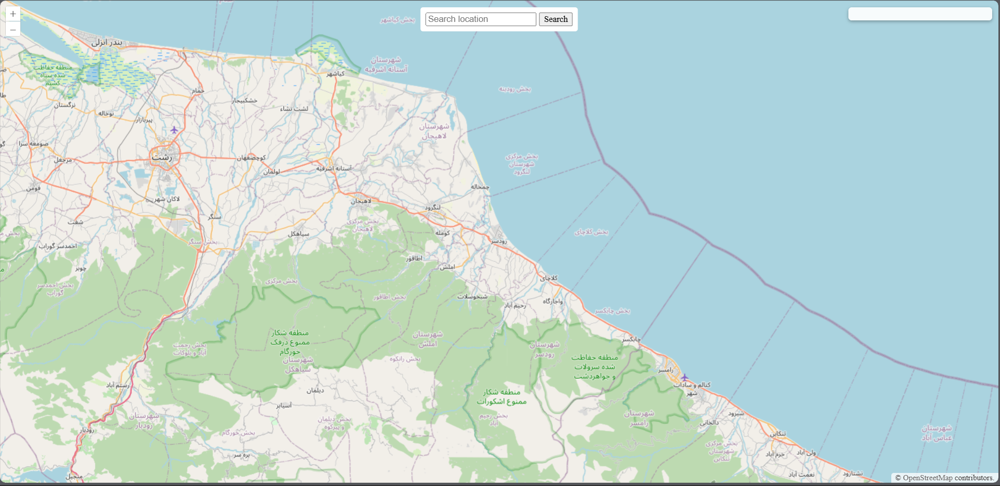
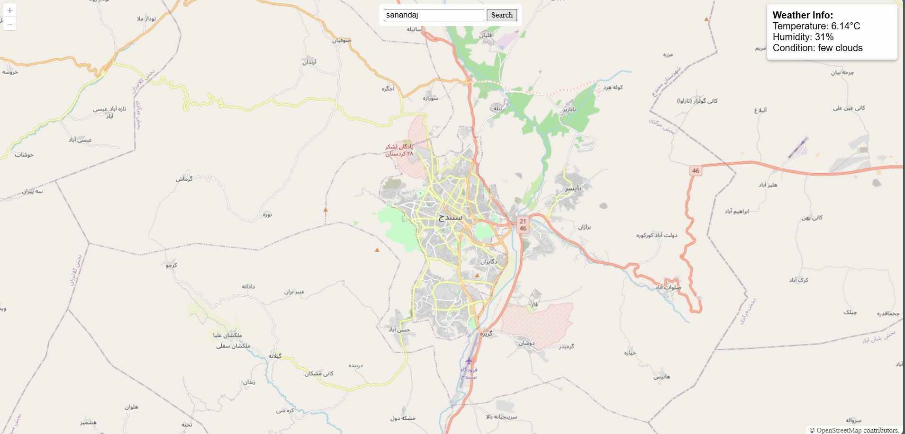
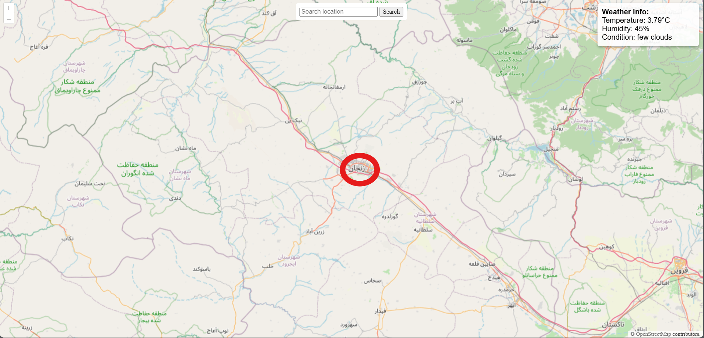
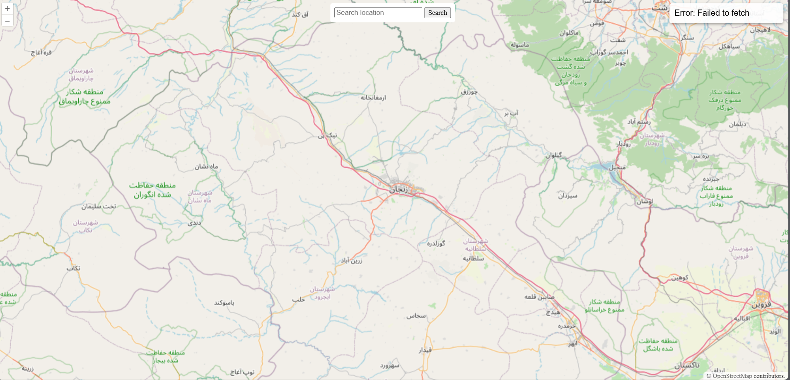
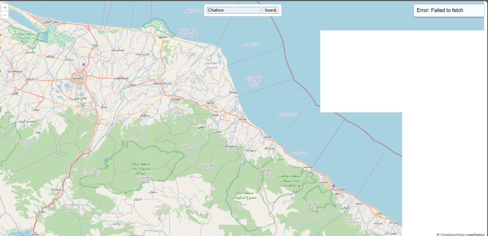

# Interactive Map with Weather Data - Part 2

## Project Overview
This part extends the interactive map by adding **weather data display** functionality. Users can **click on the map** or **search for a location**, and the application will fetch current weather data for that location using the **OpenWeatherMap API**.

- **Weather API Considered:** We researched multiple weather APIs to find the best fit.
- **Final Choice:** **OpenWeatherMap** was chosen for its generous free tier and easy integration with JavaScript.

---

## OpenLayers Features Used

- **Map Initialization (`ol.Map`)**  
  Sets up the map container and base layer.

- **Base Layer (`ol.layer.Tile` with `ol.source.OSM`)**  
  Uses OpenStreetMap tiles as the base layer.

- **View (`ol.View`)**  
  Defines the initial center and zoom level of the map.

- **Event Listener (`map.on('click', ...)`)**  
  Detects map clicks to get coordinates for weather queries.

- **Projection Conversion (`ol.proj.toLonLat`)**  
  Converts map coordinates to longitude and latitude.

- **Animations (`map.getView().animate()`)**  
  Smoothly pans and zooms the map to searched locations.

---

## Weather Data Display

- A **weather info div** is positioned on the map.
- When a user clicks on the map or searches for a location:
  1. Coordinates are obtained from the clicked location or search result.
  2. The app calls **OpenWeatherMap API** using the fetch API.
  3. The weather information is displayed in the div (Temperature, Humidity, Condition).
- **Error handling** is included for API failures or invalid locations.
- Shows **loading state** while fetching data.

---

## API Key

- **API Key** is required to authenticate requests to OpenWeatherMap.
- **Important:** Do **not** commit API keys to a public repository.
- Store your API key in `config.js` or a similar local file excluded from version control.

```js
const API_KEY = "YOUR_OPENWEATHERMAP_KEY";
const API_KEY_Loc "YOUR_LOCATIONIQ_KEY"
```
| API Name       | Website                                                          | Free Tier / Requests | Paid Tier      | Rate Limits  | Notes                           |
| -------------- | ---------------------------------------------------------------- | -------------------- | -------------- | ------------ | ------------------------------- |
| OpenWeatherMap | [https://openweathermap.org/api](https://openweathermap.org/api) | 1,000 calls/day      | From $40/month | 60 calls/min | Used in project, good free tier |
| WeatherAPI     | [https://www.weatherapi.com/](https://www.weatherapi.com/)       | 1,000 calls/month    | From $10/month | 1 call/sec   | Reliable, global coverage       |
| Weatherbit     | [https://www.weatherbit.io/api](https://www.weatherbit.io/api)   | 500 calls/day        | From $35/month | 50 calls/min | Accurate forecasts, some limits |


**Chosen API:** **OpenWeatherMap**  
**Reason:** Free tier sufficient for assignment, simple integration, reliable global weather data. and in the I used it alot you can check https://github.com/Pooyan013/CompareWeather


## How to Run Locally

1. Clone or download the repository.
2. Insert your OpenWeatherMap API key in `config.js`:

```javascript
const API_KEY = "YOUR_OPENWEATHERMAP_KEY";
const API_KEY_Loc ="YOUR_LOCATIONIQ_KEY"
```

## ScreenShots

### 1.HomePage


### 2.SearchBased Result


### 3.ClickBased Result


### 4.Error ClickBased


### 5.Error SearchBased



## Folder Structure
```
part2/
├─ index.html         → Main HTML file
├─ static/
│   └─ css/
│       └─ style.css  → Styles for map, search bar, and weather display
├─ script.js          → JS for map, click/search, and weather API calls
├─ config.js          → API keys configuration (excluded from version control)
├─ README.md          → README PartTwo
```