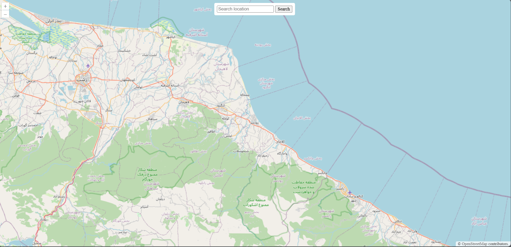

# Interactive Web GIS Project

## Project Overview
This project demonstrates an **interactive web map** with two main functionalities:

1. **Part 1: Geocoding Search**
   - Users can search for a location by name.
   - Map animates to the searched location.
   - Implemented using **OpenLayers** and **LocationIQ API**.

2. **Part 2: Weather Data Display**
   - Users can click on the map or search for a location.
   - Current weather data for the selected location is fetched from **OpenWeatherMap API** and displayed on the map.

---

## OpenLayers Features Used
- **Map Initialization (`ol.Map`)**: Sets up the map container and base layer.
- **Base Layer (`ol.layer.Tile` with `ol.source.OSM`)**: Uses OpenStreetMap tiles.
- **View (`ol.View`)**: Defines initial center and zoom.
- **Animations (`map.getView().animate()`)**: Smoothly pans/zooms to searched location.
- **Event Listeners (`map.on('click', ...)`)**: Detects map clicks for weather queries.
- **Projection Conversion (`ol.proj.toLonLat`)**: Converts coordinates to lon/lat.

---

## APIs Used

### Geocoding APIs
| API          | Website                          | Free Tier / Requests | Paid Tier        | Rate Limit     | Notes                                              |
|--------------|---------------------------------|--------------------|----------------|---------------|--------------------------------------------------|
| MapQuest     | [mapquest.com](https://www.mapquest.com/) | 15,000/month       | $0.25/1,000 req | 1 req/sec      | Initially considered but required account setup |
| LocationIQ   | [locationiq.com](https://locationiq.com/) | 5,000/month        | $4/1,000 req    | 1 req/sec      | Chosen for simplicity and free tier              |
| OpenCage     | [opencagedata.com](https://opencagedata.com/) | 2,500/day          | $50/month       | 1 req/sec      | International coverage                             |

**Chosen API:** **LocationIQ**  
**Reason:** Easy integration, sufficient free tier, worldwide coverage, no heavy account setup.

### Weather APIs
| API Name       | Website                                                    | Free Tier / Requests | Paid Tier      | Rate Limits  | Notes                           |
| -------------- | ---------------------------------------------------------- | -------------------- | -------------- | ------------ | ------------------------------- |
| OpenWeatherMap | [openweathermap.org/api](https://openweathermap.org/api)  | 1,000 calls/day      | From $40/month | 60 calls/min | Chosen for simplicity, global weather data |
| WeatherAPI     | [weatherapi.com](https://www.weatherapi.com/)             | 1,000 calls/month    | From $10/month | 1 call/sec   | Reliable, global coverage       |
| Weatherbit     | [weatherbit.io/api](https://www.weatherbit.io/api)        | 500 calls/day        | From $35/month | 50 calls/min | Accurate forecasts, some limits |

**Chosen API:** **OpenWeatherMap**  
**Reason:** Free tier sufficient for assignment, simple integration, reliable global weather data.

---

## How to Run Locally

1. Clone or download the repository.
2. Insert your API keys in `config.js`:

```javascript
const API_KEY = "YOUR_OPENWEATHERMAP_KEY";
const API_KEY_Loc = "YOUR_LOCATIONIQ_KEY";
```
## ScreenShots

### PartOne


### PartTwo

```
KNTU_WebGIS_Course_4041_A2/
├─ part1/
│  ├─ index.html
│  ├─ static/
│  │  └─ css/style.css
│  ├─ script.js
│  └─ README.md
├─ part2/
│  ├─ index.html
│  ├─ static/
│  │  └─ css/style.css
│  ├─ script.js
│  ├─ config.js
│  └─ README.md
├─ README.md       → This README (main project overview)
├─ pics/           → Screenshots used in README files
```